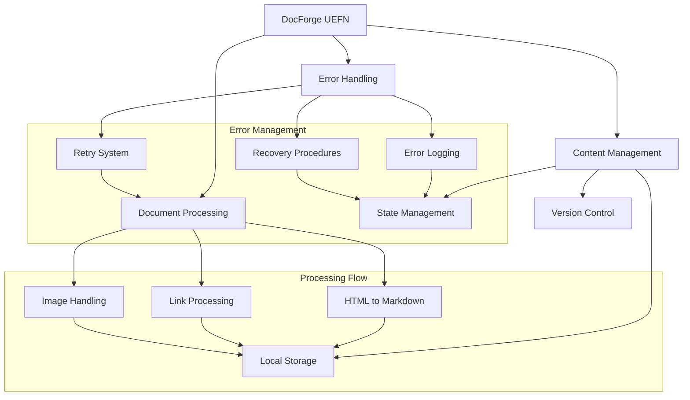

# FN Brain Vault - UEFN Fornite Documentation Archive

Call me old school but I like to print stuff out and be able to search it locally.  Epic has recently changed their site and constantly been updating or taking information offline so this allows you to keep a local copy in markdown format.  I provide NO SUPPORT for this, this is just for our own internal documentation but if it can help you go for it.

## Purpose
FN Brain Vault is a documentation preservation system for Unreal Editor for Fortnite (UEFN) that transforms Epic's online documentation into a locally maintained archive. The system scrapes and processes documentation from Epic's website, converting it into a searchable and printable format with annotation capabilities. Key features include:

- Local storage of documentation for offline access with full-text search functionality
- Print-ready formatting with support for user annotations
- Automatic processing of both online and offline content with retry handling
- Documentation preservation and archival capabilities
- Comprehensive content management including:
- Online documentation scraping and error handling
- Offline markdown processing and link fixing
- Chapter organization and numbering
- Image downloading and optimization
- Internal link processing and fixing
- Combined book generation with print-ready output
- Interactive processing menu
- Progress tracking and state persistence
- Markdown frontmatter management
- Glossary handling and cross-referencing


## Dependencies
- Python 3.8+
- Required modules:
  - aiohttp
  - nodriver
  - markdownify
  - PyYAML
  - Pillow (optional, for image optimization)

## System Architecture


## Core Components

### ProcessingManager
| Method | Parameters | Returns | Description |
|--------|------------|---------|-------------|
| process_docs | mode: str, start_chapter: Optional[int], end_chapter: Optional[int], online: bool | None | Main processing entry point |
| process_chapters | mode: str, start_chapter: Optional[int], end_chapter: Optional[int] | None | Processes documentation chapters |
| process_page | url: str, content: str, session | None | Processes individual pages |
| show_menu | None | tuple[str, Optional[int], Optional[int], bool] | Displays interactive menu |

### DownloadManager
| Method | Parameters | Returns | Description |
|--------|------------|---------|-------------|
| download_with_retry | session, url: str | tuple[bool, str] | Downloads content with retry logic |
| retry_specific_urls | urls: list, session, browser | None | Retries failed downloads |
| post_process_downloads | session, browser | None | Post-processes downloaded content |

### DocumentProcessor
| Method | Parameters | Returns | Description |
|--------|------------|---------|-------------|
| process_chapter | chapter_num: int, file_path: Path | None | Processes individual chapters |
| generate_combined_book | None | None | Generates combined documentation |
| get_chapter_for_file | file_path: Path | Optional[int] | Determines chapter number |


## Project Structure

```
.
├── FnBrainVault_uefn.py        # Main online scraping script
├── markdown_utils.py      # Shared markdown processing utilities
├── fix_markdown_links.py  # Offline link fixing and chapter organization
├── process_existing.py    # Combined online/offline processing interface
├── combine_docs.py        # Documentation combination utilities
└── book_formatter.py      # Book formatting utilities
```

## Installation

1. Clone the repository:
```bash
git clone https://github.com/yourusername/FnBrainVault.git
cd FnBrainVault
```

2. Install dependencies:
```bash
pip install -r requirements.txt
```

## Usage

### Interactive Processing Menu

The easiest way to use FnBrainVault is through the interactive menu:

```bash
python process_existing.py
```

This will present you with the following options:

1. Process all chapters (offline)
2. Process new chapters only (offline)
3. Process specific chapter range (offline)
4. Resume from last position (offline)
5. Update online documentation
6. Fix markdown links
7. Generate combined book
8. Exit

### Online Documentation Scraping

To scrape documentation from online sources:

```bash
python webmark_uefn.py
```

Options:
- `--force-download`: Force re-download of existing files
- `--skip-images`: Skip image downloading

### Offline Link Fixing

To fix markdown links and organize chapters in existing documentation:

```bash
python fix_markdown_links.py [directory]
```

If no directory is specified, it defaults to "./downloaded_docs".

## Configuration

The system uses several configuration files:

- `.download_state`: Persists download progress and state
- `.processing_state.json`: Tracks processing progress
- `.download_status.json`: Maintains download status information

## Directory Structure

The processed documentation is organized as follows:

```
downloaded_docs/
├── images/              # Downloaded and optimized images
├── print_ready/         # Print-ready versions
│   └── complete_documentation.md
├── index.md            # Generated navigation index
└── [documentation]/    # Processed markdown files
```

## Markdown Processing

The system handles several aspects of markdown processing:

1. **Frontmatter Management**
   - Title cleaning and standardization
   - Description extraction
   - Chapter number generation
   - Metadata management

2. **Link Processing**
   - Internal link fixing
   - Glossary link handling
   - Anchor link management
   - Relative path calculation

3. **Image Processing**
   - Automatic download
   - Path standardization
   - Optional optimization

4. **Chapter Organization**
   - Automatic chapter number generation
   - Section-based organization
   - API grouping
   - Template series handling

## Development

### Adding New Features

1. Core processing logic should be added to `markdown_utils.py`
2. Online-specific functionality goes in `webmark_uefn.py`
3. Offline processing features belong in `fix_markdown_links.py`
4. UI/Menu updates should be made to `process_existing.py`

### Code Style

- Follow PEP 8 guidelines
- Use type hints for function parameters and returns
- Include docstrings for all functions and classes
- Add logging for important operations
- Handle errors gracefully

## Contributing

1. Fork the repository
2. Create a feature branch
3. Make your changes
4. Add tests if applicable
5. Submit a pull request

## License

This project is licensed under the MIT License - see the LICENSE file for details.

## Changelog

### 2024-12-07
- Reorganized code to reduce duplication
- Added shared markdown processing utilities
- Improved chapter number generation
- Enhanced offline processing capabilities
- Added interactive menu system
- Improved error handling and logging
- Added documentation and README

## Known Issues

- Large files may require increased recursion limit
- Some complex HTML structures may not convert perfectly to markdown
- Image optimization requires Pillow library

## Future Improvements

- Add GUI interface
- Implement scheduled updates
- Add GitHub/Google Drive sync
- Improve template handling
- Add more documentation formats
- Enhance search capabilities