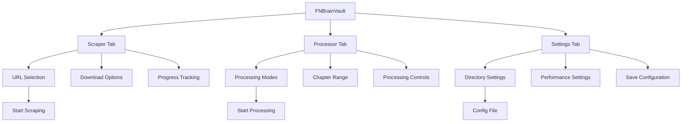

# FNBrainVault UI Component

## Purpose
Main graphical user interface for the UEFN Documentation Scraper, providing a user-friendly way to control scraping operations, process documents, and manage settings.

## Dependencies
- tkinter >= 8.6
- asyncio
- logging
- webmark_uefn
- process_existing

## Flow Diagram


## Component Structure
| Component | Purpose | Parent |
|-----------|----------|---------|
| Scraper Tab | Controls web scraping operations | Main Window |
| Processor Tab | Manages document processing | Main Window |
| Settings Tab | Configures application settings | Main Window |

## Methods

### Core Methods
| Method | Parameters | Returns | Description |
|--------|------------|---------|-------------|
| __init__ | root: tk.Tk | None | Initializes the UI and sets up tabs |
| load_config | None | Dict | Loads or creates default configuration |
| save_config | None | None | Saves current configuration to file |
| setup_logging | None | None | Configures logging for UI and file |

### Tab Initialization
| Method | Parameters | Returns | Description |
|--------|------------|---------|-------------|
| init_scraper_tab | None | None | Sets up scraping controls and progress tracking |
| init_processor_tab | None | None | Sets up document processing options |
| init_settings_tab | None | None | Sets up configuration settings |

### Operation Methods
| Method | Parameters | Returns | Description |
|--------|------------|---------|-------------|
| start_scraping | None | None | Initiates web scraping process |
| stop_scraping | None | None | Stops active scraping operation |
| start_processing | None | None | Starts document processing |
| toggle_processing | None | None | Toggles processing pause state |

## Error Handling
- Configuration loading errors default to preset values
- Invalid directory selections maintain previous value
- Scraping errors are logged and displayed in UI
- Processing errors show error dialog and maintain state

## Usage Example
```python
from FNBrainVault import FNBrainVault
import tkinter as tk

def main():
    root = tk.Tk()
    app = FNBrainVault(root)
    root.mainloop()

if __name__ == "__main__":
    main()
```

## Configuration
```json
{
    "preset_urls": {
        "UEFN Documentation": "https://dev.epicgames.com/documentation/en-us/uefn/unreal-editor-for-fortnite-documentation",
        "Fortnite Creative": "https://dev.epicgames.com/documentation/en-us/fortnite-creative/fortnite-creative-documentation"
    },
    "output_dir": "./downloaded_docs",
    "images_dir": "./downloaded_docs/images",
    "max_concurrent": 5,
    "rate_limit_delay": 0.5,
    "log_file": "webmark_uefn.log"
}
```

## Update Changelog
- 2024-03-20: Initial implementation of FNBrainVault UI
  - Added tabbed interface for scraping, processing, and settings
  - Implemented configuration management
  - Added progress tracking and logging
  - Integrated with existing scraper and processor modules

## Related Documentation
- `/docs/systems/scraping-system.md`
- `/docs/systems/document-processing.md`
- `/docs/architecture/ui-components.md`

## Type Definitions
```python
from typing import Dict, Optional
from tkinter import ttk, filedialog, messagebox
import tkinter as tk

class FNBrainVault:
    root: tk.Tk
    config: Dict
    notebook: ttk.Notebook
    scraper_tab: ttk.Frame
    processor_tab: ttk.Frame
    settings_tab: ttk.Frame
    url_var: tk.StringVar
    force_download_var: tk.BooleanVar
    download_images_var: tk.BooleanVar
    progress_var: tk.StringVar
    progress_bar: ttk.Progressbar
    log_text: tk.Text
```

## Best Practices
1. Always use asynchronous operations for scraping to prevent UI freezing
2. Maintain consistent state between UI and configuration file
3. Provide clear visual feedback for long-running operations
4. Implement proper error handling and user feedback
5. Use type hints for better code maintainability
6. Follow tkinter best practices for widget management 