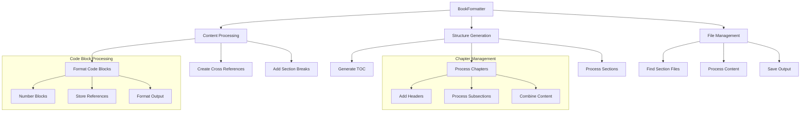

# Book Formatter Component

## Purpose
The BookFormatter component transforms markdown documentation into a structured book format with consistent code block formatting, cross-references, section breaks, and table of contents generation.

## Dependencies
- PyYAML
- re (Python standard library)
- pathlib (Python standard library)
- logging (Python standard library)
- typing (Python standard library)
- DocumentProcessor (TYPE_CHECKING only)
- ChapterInfo (from doc_types)

## Flow Diagram


## Methods

| Method | Parameters | Returns | Description |
|--------|------------|---------|-------------|
| format_code_blocks | content: str | str | Formats and numbers code blocks consistently |
| create_cross_references | content: str | str | Adds cross-references between chapters and code blocks |
| add_section_breaks | content: str | str | Adds clear section breaks between major topics |
| generate_toc | content: str | str | Generates detailed table of contents |
| process_book | processor: DocumentProcessor | str | Processes and formats complete book |
| process_chapter | chapter: ChapterInfo | str | Processes individual chapter content |
| find_section_file | title: str | Path | Finds markdown file for section |
| process_section_content | file_path: Path | str | Processes section content |

## Class Properties
```python
/**
 * @class BookFormatter
 * @description Formats and structures documentation into a cohesive book
 * @prop {Path} docs_dir - Base directory for documentation files
 * @prop {Set[str]} image_refs - Set of image references for tracking
 * @prop {Dict[str, str]} internal_links - Dictionary mapping internal links
 * @prop {List[Dict]} code_blocks - List of processed code block information
 */
```

## Error Handling
- File System Operations
  - Handles missing section files gracefully
  - Creates output directories if missing
  - Uses UTF-8 encoding for all file operations
- Content Processing
  - Validates frontmatter format
  - Handles missing or malformed code blocks
  - Manages missing chapter/section content
- Path Resolution
  - Validates file paths before processing
  - Returns None for missing section files
  - Creates parent directories as needed

## Usage Examples

### Basic Formatting
```python
from book_formatter import BookFormatter
from combine_docs import DocumentProcessor

formatter = BookFormatter("./docs")
processor = DocumentProcessor("./docs")

# Generate complete book
formatted_content = formatter.process_book(processor)
```

### Code Block Processing
```python
# Format specific content
content = """
```python
def example():
    pass
```
"""
formatted = formatter.format_code_blocks(content)
```

### TOC Generation
```python
# Generate table of contents
content = "# Section 1\n## Subsection\n# Section 2"
toc = formatter.generate_toc(content)
```

## Integration Points
- Input:
  - Raw markdown files
  - YAML frontmatter
  - Code blocks
  - Chapter information
- Output:
  - Formatted book content
  - Numbered code blocks
  - Cross-references
  - Table of contents
  - Section breaks

## Configuration
- Default output path: "./downloaded_docs/formatted/uefn_complete_guide.md"
- File encoding: UTF-8
- Section break character: "="
- Section break length: 80 characters
- Code block numbering: Sequential integers

## Method Documentation

### format_code_blocks
```python
/**
 * @method format_code_blocks
 * @description Formats and numbers code blocks consistently
 * @param {str} content - Raw markdown content
 * @returns {str} Formatted content with numbered code blocks
 * @regex {pattern} r'```(\w+)?\n(.*?)```'
 */
```

### create_cross_references
```python
/**
 * @method create_cross_references
 * @description Creates cross-references for chapters and code blocks
 * @param {str} content - Content with numbered references
 * @returns {str} Content with markdown links
 * @regex {chapter} r'Chapter (\d+)'
 */
```

### process_book
```python
/**
 * @method process_book
 * @description Processes complete book with all formatting
 * @param {DocumentProcessor} processor - Document processor instance
 * @returns {str} Complete formatted book content
 * @frontmatter Adds YAML frontmatter with title and version
 */
```

## Update Requirements
1. Update version number in CHANGELOG.md
2. Update regex patterns if markdown format changes
3. Update TOC generation if header format changes
4. Update cross-reference format if needed
5. Update code block formatting style
6. Update integration tests for new features

## Related Documentation
- /docs/systems/documentation-processing.md
- /docs/components/document_processor.md
- /docs/types/chapter_info.md

## Version History
See CHANGELOG.md for detailed version history and updates.
</rewritten_file> 