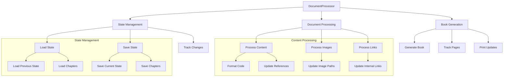

# Document Combination Component

## Purpose
The DocumentProcessor component manages the combination, processing, and organization of UEFN documentation files into a cohesive book format with state management, chapter tracking, and incremental updates.

## Dependencies
- PyYAML
- BookFormatter (local)
- ChapterInfo (from doc_types)
- Python 3.8+ (for typing)
- datetime
- json
- pathlib
- logging
- re (Python standard library)

## Flow Diagram


## Methods

| Method | Parameters | Returns | Description |
|--------|------------|---------|-------------|
| load_state | None | dict | Loads previous processing state |
| load_chapters | None | Dict[int, ChapterInfo] | Loads chapter information |
| save_state | None | None | Saves current processing state |
| save_chapters | None | None | Saves chapter information |
| estimate_pages | content: str | int | Estimates pages based on content |
| get_chapter_for_file | file_path: Path | Optional[int] | Gets chapter number from file |
| generate_print_diff | last_version: str, current_version: str | List[Tuple[int, int]] | Generates print ranges |
| process_content | content: str, file_path: Path | str | Processes content |
| process_images | content: str, file_path: Path | str | Updates image references |
| process_internal_links | content: str | str | Updates internal links |
| update_chapter_changes | chapter_num: int | None | Tracks chapter changes |
| generate_combined_book | None | None | Generates complete book |

## Class Documentation
```python
/**
 * @class DocumentProcessor
 * @description Manages documentation combination and processing
 * @prop {str} docs_dir - Documentation directory path
 * @prop {Path} state_file - State file path (.doc_state.json)
 * @prop {Path} chapter_file - Chapter index path (.chapter_index.json)
 * @prop {Dict} state - Current processing state
 * @prop {Dict[int, ChapterInfo]} chapters - Chapter information
 * @prop {int} pages_per_sheet - Pages per printed sheet (default: 2)
 * @prop {int} estimated_lines_per_page - Lines per page estimate (default: 45)
 * @prop {BookFormatter} formatter - Book formatting instance
 * @prop {Set[str]} image_refs - Image reference tracking
 * @prop {Dict[str, str]} internal_links - Internal link mapping
 */
```

## Error Handling
- File Operations
  - Creates state files if missing
  - Handles missing chapter files
  - UTF-8 encoding for all files
- Content Processing
  - Validates YAML frontmatter
  - Handles missing metadata
  - Manages missing chapters
- Image Processing
  - Validates image paths
  - Creates image directories
  - Handles missing images
- State Management
  - Validates state format
  - Handles corrupted state
  - Manages version conflicts

## Usage Examples

### Basic Usage
```python
from combine_docs import DocumentProcessor

# Initialize processor
processor = DocumentProcessor("./docs")

# Generate combined book
processor.generate_combined_book()
```

### State Management
```python
# Load and update state
processor = DocumentProcessor("./docs")
processor.update_chapter_changes(5)  # Mark chapter 5 as changed
processor.save_state()
```

### Content Processing
```python
# Process specific content
file_path = Path("./docs/chapter1.md")
with open(file_path, 'r', encoding='utf-8') as f:
    content = f.read()
processed = processor.process_content(content, file_path)
```

## Integration Points
- Input:
  - Markdown documentation files
  - YAML frontmatter metadata
  - Image assets
  - State tracking files
- Output:
  - Combined documentation book
  - Print updates guide
  - State and chapter tracking files
  - Processed images and links

## Configuration
- State Files:
  - .doc_state.json: Processing state
  - .chapter_index.json: Chapter information
- Output Files:
  - complete_documentation.md
  - print_updates.md
- Page Settings:
  - pages_per_sheet: 2
  - estimated_lines_per_page: 45
- Directories:
  - docs_dir: Base documentation directory
  - combined/: Output directory for combined book
  - images/: Processed image directory

## Method Documentation

### process_content
```python
/**
 * @method process_content
 * @description Processes and formats content before adding to book
 * @param {str} content - Raw markdown content
 * @param {Path} file_path - Path to source file
 * @returns {str} Processed content
 * @throws {ValueError} Invalid content format
 */
```

### generate_combined_book
```python
/**
 * @method generate_combined_book
 * @description Generates complete combined book with all chapters
 * @returns {None}
 * @output {File} complete_documentation.md
 * @output {File} print_updates.md
 */
```

## Update Requirements
1. Update version number in CHANGELOG.md
2. Update state file format documentation
3. Update chapter tracking logic
4. Update page estimation if format changes
5. Update integration tests for new features
6. Update BookFormatter integration

## Related Documentation
- /docs/components/book_formatter.md
- /docs/types/chapter_info.md
- /docs/systems/documentation-processing.md

## Version History
See CHANGELOG.md for detailed version history and updates.
</rewritten_file> 