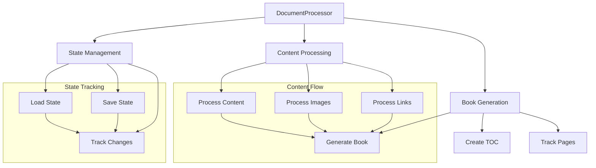

# Document Processor Component

## Purpose
The DocumentProcessor component manages the organization, processing, and combination of UEFN documentation files into a structured book format with state management, chapter tracking, and incremental updates.

## Dependencies
- PyYAML
- BookFormatter
- ChapterInfo (from doc_types)
- Python 3.8+ (for typing support)
- datetime
- json
- pathlib

## Flow Diagram


## Methods

| Method | Parameters | Returns | Description |
|--------|------------|---------|-------------|
| load_state | None | dict | Loads previous processing state |
| load_chapters | None | Dict[int, ChapterInfo] | Loads chapter information |
| save_state | None | None | Saves current processing state |
| save_chapters | None | None | Saves chapter information |
| estimate_pages | content: str | int | Estimates number of pages for content |
| get_chapter_for_file | file_path: Path | Optional[int] | Determines chapter number from file |
| generate_print_diff | last_version: str, current_version: str | List[Tuple[int, int]] | Generates page ranges for printing |
| process_content | content: str, file_path: Path | str | Processes and formats content |
| process_images | content: str, file_path: Path | str | Updates image paths and references |
| process_internal_links | content: str | str | Updates internal documentation links |
| update_chapter_changes | chapter_num: int | None | Tracks chapter changes |
| generate_combined_book | None | None | Generates complete documentation book |

## Class Documentation
```python
/**
 * @class DocumentProcessor
 * @description Manages documentation processing and book generation
 * @prop {str} docs_dir - Documentation directory path
 * @prop {Path} state_file - State tracking file path
 * @prop {Path} chapter_file - Chapter index file path
 * @prop {Dict} state - Current processing state
 * @prop {Dict[int, ChapterInfo]} chapters - Chapter information
 * @prop {int} pages_per_sheet - Pages per printed sheet
 * @prop {int} estimated_lines_per_page - Estimated lines per page
 * @prop {BookFormatter} formatter - Book formatting instance
 * @prop {Set[str]} image_refs - Image reference tracking
 * @prop {Dict[str, str]} internal_links - Internal link mapping
 */
```

## Error Handling
- File operations
  - Handles missing state/chapter files
  - Creates new state if none exists
  - UTF-8 encoding for content
- Content processing
  - Validates YAML frontmatter
  - Handles missing metadata
  - Manages missing chapters
- Path resolution
  - Validates file paths
  - Creates output directories

## Usage Examples

### Basic Usage
```python
from combine_docs import DocumentProcessor

# Initialize processor
processor = DocumentProcessor("./downloaded_docs")

# Generate combined book
processor.generate_combined_book()
```

### State Management
```python
# Load and modify state
processor = DocumentProcessor("./downloaded_docs")
state = processor.load_state()
state['last_processed']['some_file.md'] = timestamp
processor.save_state()
```

### Content Processing
```python
# Process specific content
file_path = Path("./downloaded_docs/chapter1.md")
with open(file_path, 'r', encoding='utf-8') as f:
    content = f.read()
processed = processor.process_content(content, file_path)
```

## Integration Points
- Input:
  - Markdown documentation files
  - YAML frontmatter metadata
  - Image assets
  - State tracking files
- Output:
  - Combined documentation book
  - Print updates guide
  - State and chapter tracking files
  - Processed images and links

## Configuration
- Output directory: "./downloaded_docs/combined"
- Output files:
  - complete_documentation.md
  - print_updates.md
- State files:
  - .doc_state.json
  - .chapter_index.json
- Page estimation:
  - pages_per_sheet: 2
  - estimated_lines_per_page: 45

## Update Requirements
1. Update version number in CHANGELOG.md
2. Update state file format documentation
3. Update chapter tracking logic
4. Update page estimation if format changes
5. Update integration tests for new features

## Version History
See CHANGELOG.md for detailed version history and updates.
</rewritten_file> 