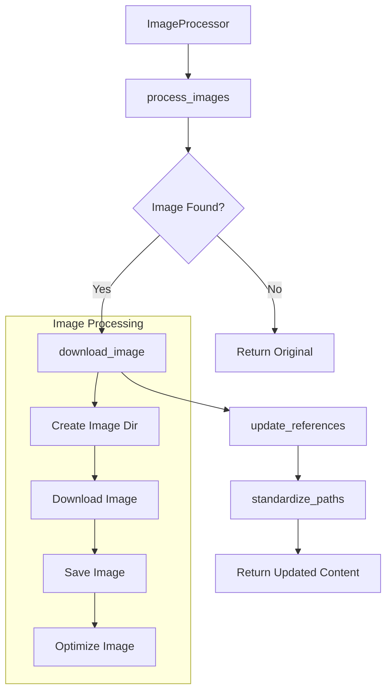

# Image Processor Component

## Purpose
The ImageProcessor component handles all image-related operations including downloading, processing, path standardization, and reference tracking for markdown documentation.

## Dependencies
- aiohttp: For asynchronous HTTP requests
- pathlib: For path manipulation
- logging: For error and operation logging
- ConfigManager: For configuration settings
- typing: For type hints

## Flow Diagram


## Methods

| Method | Parameters | Returns | Description |
|--------|------------|---------|-------------|
| process_images | content: str, session: aiohttp.ClientSession, base_url: str | str | Processes all images in content, downloads them and updates paths |
| download_image | session: aiohttp.ClientSession, img_url: str, base_url: str | Optional[str] | Downloads and optimizes a single image |
| get_image_references | None | Set[Tuple[str, str]] | Returns set of processed image references |

## Error Handling
- Failed downloads are logged with error messages
- Invalid image URLs are skipped and logged
- Network timeouts are handled gracefully
- File system errors are caught and logged
- Duplicate image names are handled with counter suffixes

## Usage Examples
```python
# Initialize ImageProcessor
image_processor = ImageProcessor("./docs_dir")

# Process images in markdown content
async with aiohttp.ClientSession() as session:
    updated_content = await image_processor.process_images(
        content,
        session,
        "https://base.url"
    )

# Get processed image references
image_refs = image_processor.get_image_references()
```

## Integration Points
- Integrates with MarkdownProcessor for content processing
- Used by WebMarkScraper for online documentation
- Utilized by ProcessingManager for offline processing
- Coordinates with DocumentProcessor for book generation

## Configuration
Required configuration in config.yaml:
```yaml
output_dir: "./downloaded_docs"
images_dir: "images"
max_concurrent_downloads: 5
rate_limit_delay: 0.5
```

## Update Changelog

### 2024-12-08
- Initial documentation created
- Added flow diagram
- Documented error handling
- Added usage examples
- Included configuration requirements

## Type Definitions
```python
from typing import Set, Tuple, Optional
from pathlib import Path
import aiohttp

class ImageProcessor:
    """
    Handles image processing operations for markdown documentation.
    
    Attributes:
        docs_dir (Path): Base directory for documentation
        image_refs (Set[Tuple[str, str]]): Set of processed image references
    """
    
    async def process_images(
        self, 
        content: str, 
        session: aiohttp.ClientSession,
        base_url: str
    ) -> str:
        """
        Process all images in content.
        
        Args:
            content: Markdown content containing image references
            session: aiohttp client session for downloads
            base_url: Base URL for resolving relative paths
            
        Returns:
            Updated content with processed image references
        """
        pass
```

## Best Practices
1. Always use async/await for image downloads
2. Implement rate limiting for multiple downloads
3. Handle duplicate image names appropriately
4. Maintain consistent image directory structure
5. Log all operations for debugging
6. Clean up failed downloads
7. Validate image files after download
8. Use relative paths in markdown content

## Testing
- Test image downloads with various URL formats
- Verify path standardization
- Check duplicate handling
- Validate error scenarios
- Test concurrent downloads
- Verify reference tracking 