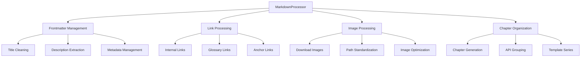

# Markdown Processing Utilities

## Purpose
Core markdown processing utilities for handling documentation conversion, formatting, and organization.

## Dependencies
- beautifulsoup4>=4.9.3
- markdownify>=0.11.0
- PyYAML>=6.0
- Pillow>=9.0.0 (optional, for image optimization)

## Flow Diagram


## Class: MarkdownProcessor

### Purpose
Handles all aspects of markdown processing, including frontmatter management, link processing, image handling, and chapter organization.

### Methods

| Method | Parameters | Returns | Description |
|--------|------------|---------|-------------|
| __init__ | output_dir: str | None | Initialize processor with output directory |
| clean_title | title: str | str | Clean up title by removing common suffixes |
| fix_frontmatter | content: str | tuple[dict, str] | Fix and parse frontmatter |
| fix_frontmatter_and_content | content: str, filepath: Path | tuple[str, bool] | Fix frontmatter and content structure |
| generate_chapter_number | filepath: Path | int | Generate chapter number based on path |
| process_images | content: str, session, base_url: str | str | Process images in content |
| download_image | session, img_url: str, base_url: str | Optional[str] | Download and optimize image |
| process_internal_links | content: str, base_url: str, current_file_path: str | str | Update internal documentation links |
| save_content | url: str, content: str, title: str | str | Save processed content to file |

### Error Handling
- Frontmatter parsing errors are caught and return empty metadata
- Image download failures are logged and skipped
- Link processing errors are logged and original links preserved
- File operation errors are logged with detailed messages

### Usage Examples

```python
from markdown_utils import MarkdownProcessor

# Initialize processor
processor = MarkdownProcessor("./downloaded_docs")

# Process content
content = "# Title\nSome content"
metadata, rest = processor.fix_frontmatter(content)

# Clean title
title = processor.clean_title("My Title - Documentation - Epic Games")
# Returns: "My Title"

# Generate chapter number
chapter = processor.generate_chapter_number(Path("docs/getting-started/intro.md"))
# Returns: 1

# Save content
filepath = processor.save_content(
    "https://example.com/doc",
    "# Title\nContent",
    "Document Title"
)
```

## Integration Points

### With webmark_uefn.py
- Used for real-time processing of scraped content
- Handles image downloads during scraping
- Manages frontmatter during initial processing

### With fix_markdown_links.py
- Used for offline link fixing
- Handles chapter number generation
- Manages content structure cleanup

### With process_existing.py
- Used for both online and offline processing
- Handles content updates and fixes
- Manages documentation organization

## Configuration

### Output Directory Structure
```
output_dir/
├── images/              # Downloaded images
├── print_ready/         # Print versions
└── [documentation]/    # Processed files
```

### Chapter Number Ranges
- 1-99: Standard documentation
- 100-499: Feature documentation
- 500-999: Template series
- 1000+: API documentation

## Error Scenarios

1. Frontmatter Parsing
   - Invalid YAML: Falls back to line-by-line parsing
   - Missing frontmatter: Returns empty metadata
   - Malformed content: Preserves original content

2. Image Processing
   - Download failures: Logs error, skips image
   - Invalid paths: Logs error, maintains original link
   - Optimization failures: Logs error, keeps original image

3. Link Processing
   - Broken links: Logs error, preserves original link
   - Invalid anchors: Removes anchor, keeps base link
   - Missing targets: Logs error, maintains original link

4. Chapter Generation
   - Unknown patterns: Uses sequential numbering
   - Duplicate numbers: Increments to next available
   - Invalid paths: Falls back to default numbering

## Type Definitions

```python
from typing import Dict, List, Tuple, Optional
from pathlib import Path
from datetime import datetime

class MarkdownProcessor:
    output_dir: str
    existing_chapters: Dict[str, int]
    processed_urls: set[str]
    image_refs: set[str]
    
    def clean_title(self, title: str) -> str: ...
    def fix_frontmatter(self, content: str) -> Tuple[Dict, str]: ...
    def generate_chapter_number(self, filepath: Path) -> int: ...
    async def process_images(
        self, content: str, session, base_url: str
    ) -> str: ...
``` 