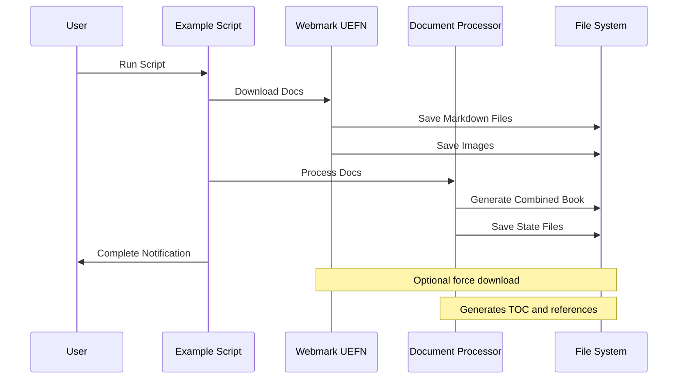

# Example Usage Script

## Purpose
Demonstrates the complete documentation processing workflow by combining the webmark_uefn downloader and DocumentProcessor into a single, easy-to-use script.

## Dependencies
- asyncio (Python standard library)
- webmark_uefn.py (local)
- combine_docs.py (local)
- Python 3.8+ (for asyncio support)

## Flow Diagram


## Script Documentation
```python
/**
 * @script example_usage.py
 * @description End-to-end documentation processing example
 * @dependencies 
 *   - webmark_uefn.py
 *   - combine_docs.py
 * @input None
 * @output 
 *   - Downloaded markdown files
 *   - Combined documentation book
 *   - State tracking files
 */
```

## Methods

| Method | Parameters | Returns | Description |
|--------|------------|---------|-------------|
| process_documentation | force_download: bool = False | None | Runs complete documentation processing workflow |

## Usage Examples

### Basic Usage
```python
# Process documentation using existing downloads
await process_documentation()
```

### Force Download
```python
# Force fresh download and processing
await process_documentation(force_download=True)
```

## Integration Points
- Input:
  - webmark_uefn.py for documentation download
  - combine_docs.py for processing
- Output:
  - ./downloaded_docs/: Individual markdown files
  - ./downloaded_docs/combined/: Combined book
  - ./downloaded_docs/images/: Downloaded images
  - State tracking files (.doc_state.json, .chapter_index.json)

## Error Handling
- Download Errors:
  - Network connectivity issues
  - Invalid URLs
  - Rate limiting
- Processing Errors:
  - File system permissions
  - Invalid markdown format
  - Missing dependencies

## Method Documentation

### process_documentation
```python
/**
 * @method process_documentation
 * @description Processes UEFN documentation end-to-end
 * @param {bool} force_download - Whether to force fresh download
 * @returns {None}
 * @throws {NetworkError} Download/connectivity issues
 * @throws {FileSystemError} File access/write issues
 */
```

## Configuration
- Default directories:
  - Download directory: "./downloaded_docs"
  - Combined output: "./downloaded_docs/combined"
  - Images directory: "./downloaded_docs/images"
- State files:
  - .doc_state.json: Processing state
  - .chapter_index.json: Chapter information

## Update Requirements
1. Update version number in CHANGELOG.md
2. Update script documentation
3. Update execution commands
4. Update environment requirements
5. Update integration tests
6. Update workflow diagram

## Related Documentation
- /docs/scripts/webmark_uefn.md
- /docs/components/combine_docs.md
- /docs/systems/documentation-processing.md

## Version History
See CHANGELOG.md for detailed version history and updates. 