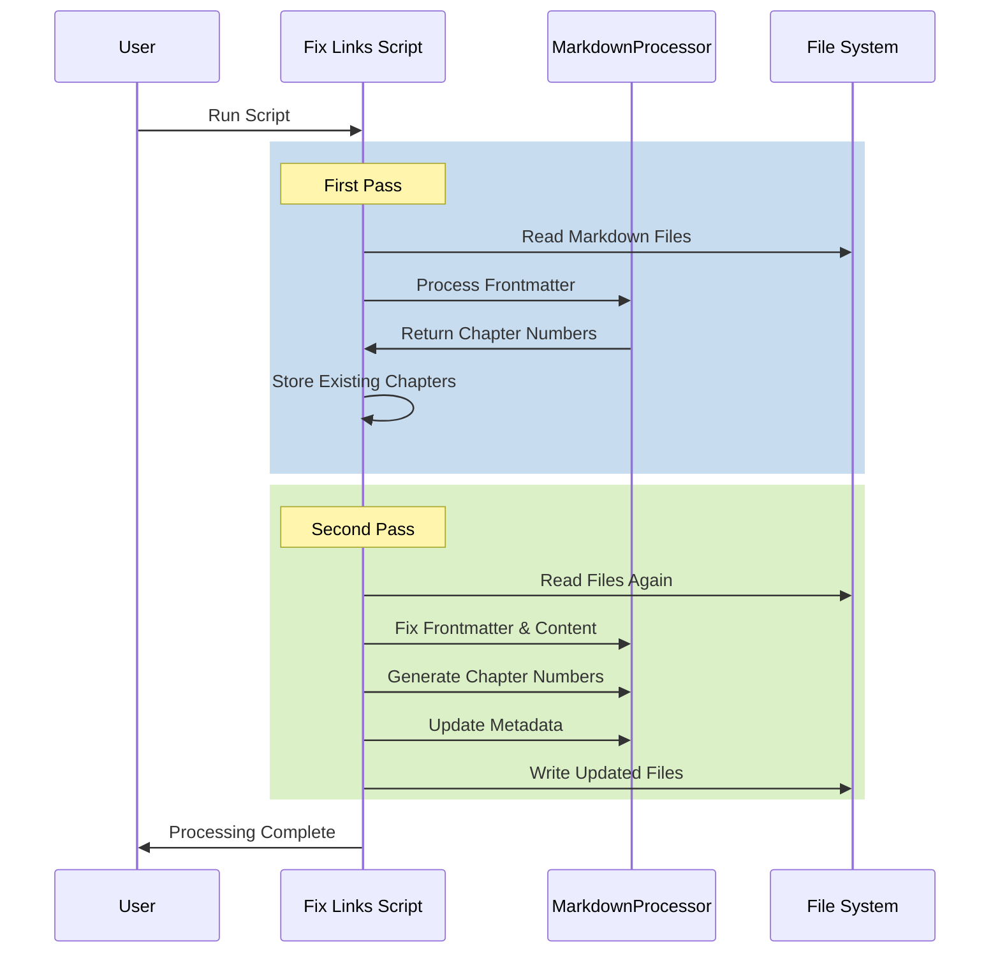

# Markdown Link Fixer Script

## Purpose
Processes markdown files to fix links, add/update chapter numbers, and ensure consistent frontmatter structure across documentation files.

## Dependencies
- yaml
- pathlib (Python standard library)
- logging (Python standard library)
- markdown_utils.MarkdownProcessor (local)
- Python 3.8+

## Flow Diagram


## Script Documentation
```python
/**
 * @script fix_markdown_links.py
 * @description Fixes markdown links and manages chapter numbering
 * @dependencies 
 *   - yaml
 *   - markdown_utils.py
 * @input Directory containing markdown files
 * @output Updated markdown files with fixed links and chapter numbers
 */
```

## Methods

| Method | Parameters | Returns | Description |
|--------|------------|---------|-------------|
| fix_markdown_links | directory: str | None | Processes markdown files to fix links and chapter numbers |

## Usage Examples

### Basic Usage
```python
# Process files in default directory
fix_markdown_links("./downloaded_docs")
```

### Custom Directory
```python
# Process files in specific directory
fix_markdown_links("/path/to/markdown/files")
```

## Integration Points
- Input:
  - Directory containing markdown files
  - Existing chapter numbers from frontmatter
  - MarkdownProcessor for content processing
- Output:
  - Updated markdown files with:
    - Fixed frontmatter
    - Consistent chapter numbers
    - Fixed internal links

## Error Handling
- File Operations:
  - Invalid file encoding
  - Permission issues
  - Missing files
- Content Processing:
  - Invalid YAML frontmatter
  - Malformed markdown content
  - Invalid chapter numbers

## Method Documentation

### fix_markdown_links
```python
/**
 * @method fix_markdown_links
 * @description Process markdown files to fix links and chapter numbers
 * @param {str} directory - Path to markdown files directory
 * @returns {None}
 * @throws {IOError} File read/write issues
 * @throws {YAMLError} Invalid frontmatter format
 */
```

## Configuration
- Default directory: "./downloaded_docs"
- File pattern: "*.md"
- Logging level: INFO
- Encoding: UTF-8

## Processing Steps
1. First Pass:
   - Read all markdown files
   - Extract existing chapter numbers
   - Store chapter mapping
2. Second Pass:
   - Fix frontmatter structure
   - Update/add chapter numbers
   - Fix content formatting
   - Write updated files

## Update Requirements
1. Update version number in CHANGELOG.md
2. Update script documentation
3. Update markdown processing rules
4. Update chapter numbering logic
5. Update integration tests
6. Update error handling

## Related Documentation
- /docs/utils/markdown_utils.md
- /docs/components/combine_docs.md
- /docs/systems/documentation-processing.md

## Version History
See CHANGELOG.md for detailed version history and updates. 