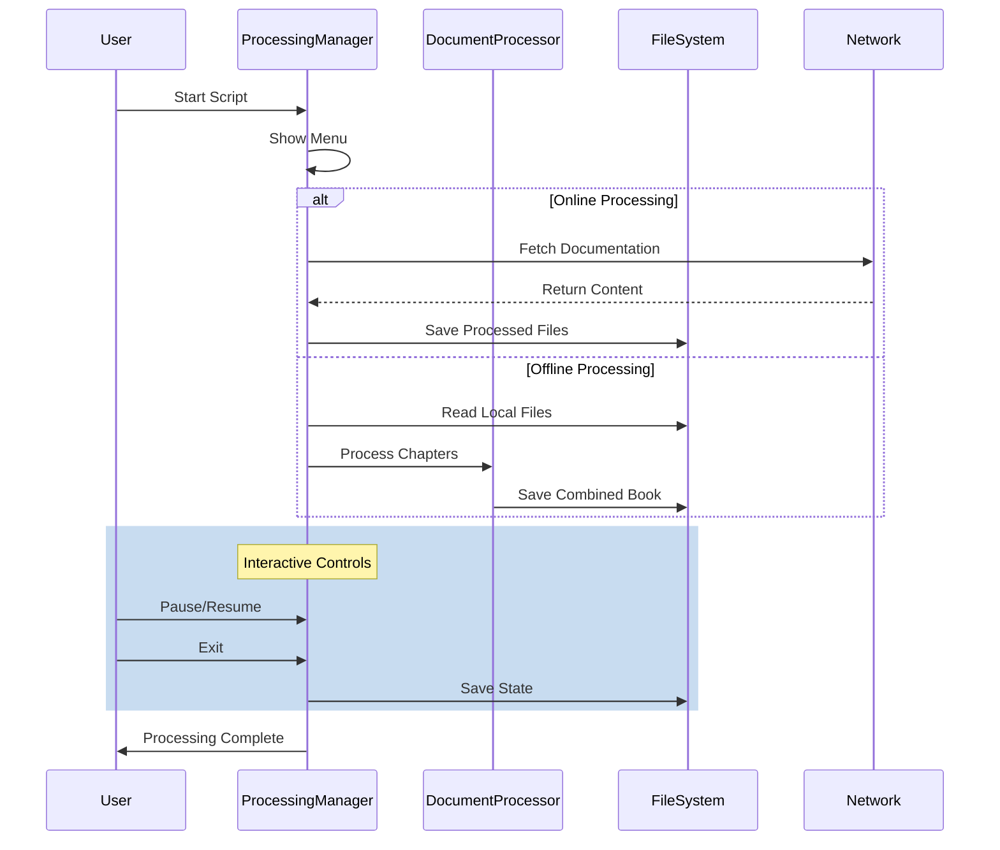

# Documentation Processing Manager

## Purpose
Manages the processing, combination, and organization of UEFN documentation with interactive controls, state management, and multiple processing modes including online and offline operations.

## Dependencies
- aiohttp
- asyncio
- combine_docs.DocumentProcessor (local)
- book_formatter.BookFormatter (local)
- markdown_utils.MarkdownProcessor (local)
- Python 3.8+ (for asyncio and typing)
- Platform-specific terminal libraries (msvcrt for Windows, tty/termios for Unix)

## Flow Diagram


## Methods

| Method | Parameters | Returns | Description |
|--------|------------|---------|-------------|
| __init__ | docs_dir: str | None | Initializes processing manager |
| load_state | None | None | Loads processing state from file |
| save_state | None | None | Saves current processing state |
| show_menu | None | tuple[str, Optional[int], Optional[int], bool] | Displays interactive menu |
| process_docs | mode: str, start_chapter: Optional[int], end_chapter: Optional[int], online: bool | None | Main processing function |
| process_chapters | mode: str, start_chapter: Optional[int], end_chapter: Optional[int] | None | Processes chapter range |
| process_online_docs | base_url: str | None | Processes online documentation |
| toggle_pause | None | None | Toggles processing pause state |

## Usage Examples

### Basic Usage
```python
# Start interactive processor
manager = ProcessingManager()
manager.process_docs('all', None, None, False)
```

### Online Processing
```python
# Process online documentation
manager = ProcessingManager()
asyncio.run(manager.process_online_docs())
```

### Specific Chapter Range
```python
# Process chapters 5-10
manager = ProcessingManager()
manager.process_docs('range', 5, 10, False)
```

## Interactive Menu Options
1. Process all chapters (offline)
2. Process new chapters only (offline)
3. Process specific chapter range (offline)
4. Resume from last position (offline)
5. Update online documentation
6. Fix markdown links
7. Generate combined book
8. Exit

## Error Handling
- File Operations:
  - Invalid file paths
  - Permission issues
  - State file corruption
- Network Operations:
  - Connection failures
  - Invalid responses
  - Rate limiting
- Processing:
  - Invalid chapter numbers
  - Malformed content
  - Interruption recovery

## Configuration
- Default directory: "./downloaded_docs"
- State file: .processing_state.json
- Online base URL: https://dev.epicgames.com/documentation/en-us/uefn
- Keyboard controls:
  - 'p': Pause/Resume
  - Ctrl+C: Save and exit

## Processing Modes
1. All Chapters:
   - Processes entire documentation set
   - Generates complete book
2. New Chapters:
   - Processes only unprocessed chapters
   - Updates existing book
3. Chapter Range:
   - Processes specified chapter range
   - Maintains existing content
4. Resume:
   - Continues from last position
   - Uses saved state

## Update Requirements
1. Update version number in CHANGELOG.md
2. Update menu options documentation
3. Update processing modes
4. Update state file format
5. Update keyboard controls
6. Update integration tests

## Related Documentation
- /docs/components/combine_docs.md
- /docs/components/book_formatter.md
- /docs/utils/markdown_utils.md
- /docs/scripts/fix_markdown_links.md

## Version History
See CHANGELOG.md for detailed version history and updates. 