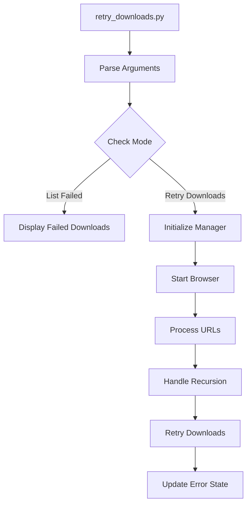

# Retry Downloads Script

## Purpose
Provides functionality to retry failed downloads from the DocForge UEFN documentation scraping process, with support for handling recursion errors and specific URL retries.

## Dependencies
- aiohttp
- asyncio
- argparse
- json
- pathlib
- DocForge UEFN DownloadManager

## Flow Diagram


## Methods

| Method | Parameters | Returns | Description |
|--------|------------|---------|-------------|
| retry_downloads | urls: list = None, force_recursion: bool = False | None | Main async function to retry failed downloads |
| main | None | None | CLI entry point for retry functionality |

## Error Handling
- Recursion limit management
  - Optional increase of recursion limit
  - Restoration of original limit after completion
- Browser session handling
  - Graceful browser cleanup
  - Session management
- Failed download tracking
  - JSON-based error storage
  - Error type and message preservation

## Usage Examples

### Basic Retry
```python
from retry_downloads import retry_downloads
import asyncio

asyncio.run(retry_downloads())
```

### Force Recursion Limit
```python
asyncio.run(retry_downloads(force_recursion=True))
```

### Retry Specific URLs
```python
urls = [
    "https://dev.epicgames.com/documentation/example1",
    "https://dev.epicgames.com/documentation/example2"
]
asyncio.run(retry_downloads(urls=urls))
```

### CLI Usage
```bash
# List failed downloads
python retry_downloads.py --list-failed

# Retry with increased recursion limit
python retry_downloads.py --force-recursion

# Retry specific URLs
python retry_downloads.py --urls url1 url2
```

## Integration Points
- Input: 
  - Failed download URLs from recursion_errors.json
  - Command line arguments for specific URLs
- Output:
  - Updated recursion_errors.json
  - Downloaded documentation files
  - Console status messages

## Configuration
- Output directory: "./downloaded_docs"
- Error tracking file: recursion_errors.json
- Browser settings:
  - headless: False
  - language: "en-US"

## Function Documentation

### retry_downloads
```python
/**
 * @function retry_downloads
 * @description Retries downloading failed URLs with optional recursion limit increase
 * @param {list} urls - Optional list of specific URLs to retry
 * @param {bool} force_recursion - Whether to increase recursion limit
 * @returns {None}
 * @throws {Exception} Browser initialization errors
 * @example
 * await retry_downloads(force_recursion=True)
 */
```

### main
```python
/**
 * @function main
 * @description CLI entry point for retry functionality
 * @param {None}
 * @returns {None}
 * @example
 * python retry_downloads.py --force-recursion
 */
```

## Update Requirements
1. Update version number in CHANGELOG.md
2. Update documentation for modified retry logic
3. Update error handling documentation
4. Update CLI argument documentation
5. Update integration tests if modified

## Version History
See CHANGELOG.md for detailed version history and updates. 