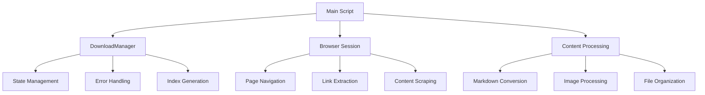
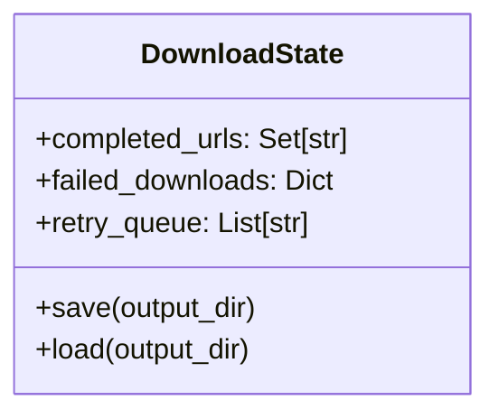
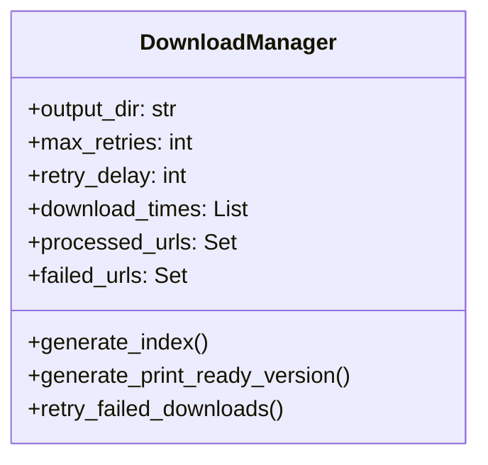
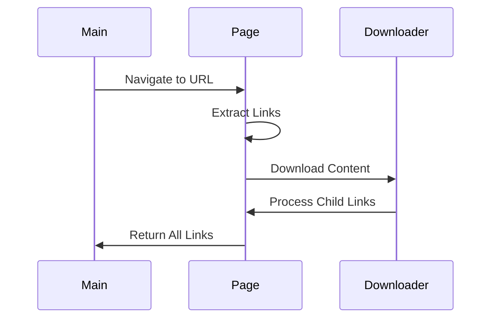
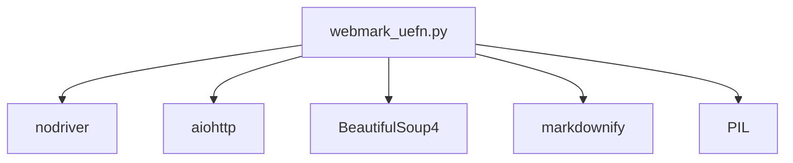

# WebMark UEFN Documentation Scraper


UEFN Documentation Scraper and Processor
======================================

This module provides functionality to scrape, download, and process UEFN (Unreal Editor for Fortnite)
documentation into a well-organized markdown format with chapter organization.

## System Architecture 



## Overview
The WebMark UEFN script is the main component responsible for scraping, processing, and organizing UEFN documentation from Epic Games' website.

Usage:
------
### 1. Standalone usage:

```python
from webmark_uefn import main
import asyncio

#### Basic usage

asyncio.run(main())

## With options

asyncio.run(main(force_download=True, download_images=True))
```

### 2. Usage with combine_docs.py:

```python
from webmark_uefn import DocumentProcessor
from combine_docs import DocumentProcessor as CombineProcessor

# First download and process the documentation
async def process_docs():
await main(force_download=False, download_images=True)

# Then combine the processed documents
doc_processor = CombineProcessor("./downloaded_docs")
doc_processor.generate_combined_book()
```


Configuration:
-------------
- BASE_URL: The root URL for UEFN documentation
- OUTPUT_DIR: Directory where downloaded docs will be saved
- MAX_CONCURRENT_DOWNLOADS: Limit on simultaneous downloads
- RATE_LIMIT_DELAY: Delay between requests to avoid rate limiting

Requirements:
------------
- Python 3.7+
- Dependencies listed in requirements.txt

Features:
---------
- Automatic chapter organization
- Image downloading and optimization
- Internal link processing
- Markdown conversion
- YAML frontmatter generation
- Progress tracking and resume capability
"""


## Core Components

### DownloadState Class


**Purpose**: Manages the state of downloaded content and provides persistence.


### DownloadManager Class


**Purpose**: Manages the download process, including retries, error handling, and state management.

## Key Functions

### scrape()
**Purpose**: Wrapper for the main scraping function.
**Parameters**:
- base_url (str): The base URL to start scraping from.
- force_download (bool): Force redownload of existing content.
- download_images (bool): Enable/disable image downloading.

### main()
**Purpose**: Entry point for the scraping process.
**Parameters**:
- force_download (bool): Force redownload of existing content.
- download_images (bool): Enable/disable image downloading.

### get_links_and_download()
**Purpose**: Recursively discovers and processes documentation pages
**Flow**:


## Error Handling
The script implements comprehensive error handling for:
- Network failures (502, 504)
- Recursion limits
- Content parsing errors
- Browser session issues

## Usage

### Basic Usage

```bash
python webmark_uefn.py
```

### Advanced Options

```bash
python webmark_uefn.py --force-download --no-images
```

## Dependencies



## Output Structure
```
/downloaded_docs
├── documentation/
│   └── en-us/
│       └── uefn/
├── images/
├── index.md
└── .download_state
```


