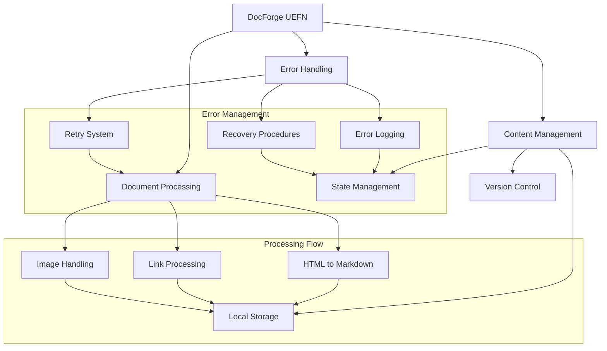

# DocForge UEFN System Documentation

## Purpose
DocForge UEFN is a documentation preservation system for Unreal Editor for Fortnite (UEFN). It transforms Epic's online documentation into a locally maintained, searchable archive with print capabilities and annotation support.

## Dependencies
- Python 3.8+
- Required modules:
  - aiohttp
  - nodriver
  - markdownify
  - PyYAML
  - Pillow (optional, for image optimization)

## System Architecture


## Core Components

### ProcessingManager
| Method | Parameters | Returns | Description |
|--------|------------|---------|-------------|
| process_docs | mode: str, start_chapter: Optional[int], end_chapter: Optional[int], online: bool | None | Main processing entry point |
| process_chapters | mode: str, start_chapter: Optional[int], end_chapter: Optional[int] | None | Processes documentation chapters |
| process_page | url: str, content: str, session | None | Processes individual pages |
| show_menu | None | tuple[str, Optional[int], Optional[int], bool] | Displays interactive menu |

### DownloadManager
| Method | Parameters | Returns | Description |
|--------|------------|---------|-------------|
| download_with_retry | session, url: str | tuple[bool, str] | Downloads content with retry logic |
| retry_specific_urls | urls: list, session, browser | None | Retries failed downloads |
| post_process_downloads | session, browser | None | Post-processes downloaded content |

### DocumentProcessor
| Method | Parameters | Returns | Description |
|--------|------------|---------|-------------|
| process_chapter | chapter_num: int, file_path: Path | None | Processes individual chapters |
| generate_combined_book | None | None | Generates combined documentation |
| get_chapter_for_file | file_path: Path | Optional[int] | Determines chapter number |

## Error Handling
1. Download Failures
   - Automatic retry with exponential backoff
   - Maximum retry attempts configurable
   - Failed downloads logged for manual retry

2. Recursion Errors
   - Tracked in recursion_errors.json
   - Optional recursion limit increase
   - Manual retry capability

3. State Management
   - Progress saved periodically
   - Recoverable from interruption
   - State files maintained for resume capability

## Usage Examples

### Basic Usage
```python
from process_existing import ProcessingManager

manager = ProcessingManager()
manager.process_docs('all', None, None, False)
```

### Retry Failed Downloads
```python
from retry_downloads import retry_downloads
import asyncio

asyncio.run(retry_downloads(force_recursion=True))
```

### Process Specific Chapters
```python
manager = ProcessingManager()
manager.process_docs('range', start_chapter=100, end_chapter=200, online=False)
```

## Integration Points
- Input: Epic Games UEFN documentation (HTML)
- Output: 
  - Markdown files in downloaded_docs/
  - Combined documentation book
  - Print-ready version
  - Navigation structure
  - Image assets

## Configuration
- OUTPUT_DIR: "./downloaded_docs"
- IMAGES_DIR: "./downloaded_docs/images"
- MAX_CONCURRENT_DOWNLOADS: 5
- RATE_LIMIT_DELAY: 0.5 seconds
- LOG_FILE: "docforge_uefn.log"

## Update Requirements
1. Update version number in CHANGELOG.md
2. Update documentation for modified components
3. Update system architecture diagram if flow changes
4. Update integration tests
5. Update requirements.txt for dependency changes

## Version History
See CHANGELOG.md for detailed version history and updates. 