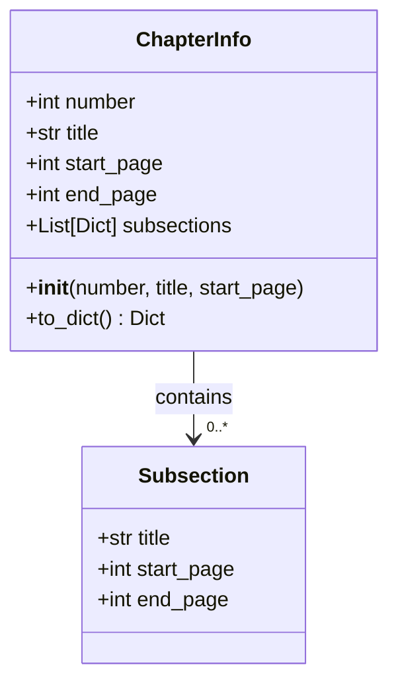

# Documentation Types

## Purpose
Defines core data types and structures used throughout the documentation processing system, with a focus on chapter information management and serialization.

## Dependencies
- dataclasses (Python standard library)
- typing (Python standard library)

## Flow Diagram


## Types

### ChapterInfo
```python
/**
 * @class ChapterInfo
 * @description Represents structured information about a documentation chapter
 * @prop {int} number - Chapter number
 * @prop {str} title - Chapter title
 * @prop {int} start_page - Starting page number
 * @prop {int} end_page - Ending page number (updated as content is added)
 * @prop {List[Dict]} subsections - List of subsection information
 */
```

## Methods

| Method | Parameters | Returns | Description |
|--------|------------|---------|-------------|
| __init__ | number: int, title: str, start_page: int | None | Initializes a new ChapterInfo instance |
| to_dict | None | Dict | Converts chapter info to dictionary format |

## Usage Examples

### Creating a Chapter
```python
# Create new chapter
chapter = ChapterInfo(
    number=1,
    title="Introduction",
    start_page=1
)

# Add subsection
chapter.subsections.append({
    'title': 'Getting Started',
    'start_page': 1,
    'end_page': 5
})

# Convert to dictionary
chapter_dict = chapter.to_dict()
```

### Serialization
```python
# Serialize chapter info
chapter_data = chapter.to_dict()
"""
{
    'number': 1,
    'title': 'Introduction',
    'start_page': 1,
    'end_page': 1,
    'subsections': [
        {
            'title': 'Getting Started',
            'start_page': 1,
            'end_page': 5
        }
    ]
}
"""
```

## Integration Points
- Input:
  - Chapter metadata from markdown files
  - Page numbering from DocumentProcessor
  - Subsection information from content processing
- Output:
  - Serialized chapter information for state management
  - Structured data for TOC generation
  - Page range information for print updates

## Error Handling
- Type Validation:
  - number must be positive integer
  - start_page must be positive integer
  - title must be non-empty string
- Data Integrity:
  - end_page must be >= start_page
  - subsections must maintain page order
  - no overlapping page ranges

## Method Documentation

### __init__
```python
/**
 * @method __init__
 * @description Initialize new chapter information
 * @param {int} number - Chapter number
 * @param {str} title - Chapter title
 * @param {int} start_page - Starting page number
 * @validates number > 0
 * @validates start_page > 0
 * @validates title is not empty
 */
```

### to_dict
```python
/**
 * @method to_dict
 * @description Convert chapter info to dictionary format
 * @returns {Dict} Serialized chapter information
 * @format {
 *   number: int,
 *   title: str,
 *   start_page: int,
 *   end_page: int,
 *   subsections: List[Dict]
 * }
 */
```

## Update Requirements
1. Update version number in CHANGELOG.md
2. Update type definitions if structure changes
3. Update serialization format documentation
4. Update validation rules documentation
5. Update integration tests for new features

## Related Documentation
- /docs/components/combine_docs.md
- /docs/components/book_formatter.md
- /docs/systems/documentation-processing.md

## Version History
See CHANGELOG.md for detailed version history and updates. 